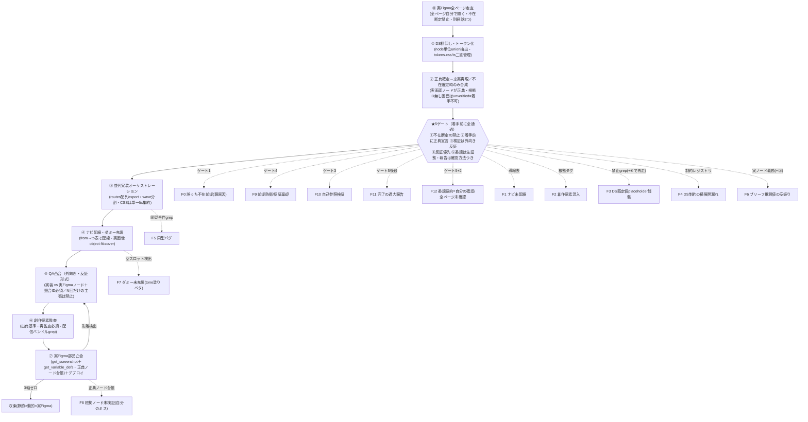

> **正本(SOT)=ここ(`~/.claude/skills/mikeneko-frontend`)**。コンテナ等のコピーは同期複製。改訂は必ずここを直してから配布する。

# DS＋実画面Figma → 画面群 忠実再現 ワークフロー

> **このスキルを通る作業は Workflow ツールでエージェントチームを組んで回す（本人指示 2026-09-11「全作業に入れたいマストで」）。** 規模は small（5体未満）を既定、量産ワーカーは model:"sonnet" を明示、単発の Agent 呼び出しで済ませない。

> 前提状況: **DS部品のFigma(master)を正典として扱う**（存在も着手時に確認）。完成画面のFigmaも**在るかもしれない**。
> **着手時にまずFigmaの実ページを全部自分で読み、正典を確定する。想像・創作はしない。実画面がある通りに再現する。**
> オーケストレーター(自分)は **マネジメント + レビュー + 裁定** 専任。**実装コードは書かない。**

> **ユーザーの最重要指示（この順序を絶対に崩さない）**:
> 1. 「〜は無い」を軽々しく言わない（不在断定禁止）。ツール1回の空/少数返りは**取得失敗のシグナル**であって不在の証拠ではない。
> 2. 着手時に実Figmaの全ページを自分で開き、正典（fileKey／全ページID／各画面の根拠ノードID）を宣言する。
> 3. その通りに忠実再現する。**合成(創作)は既定路線ではなく、実画面が本当に無いとゲート通過で確定した場合に限る最終手段。**

> **対象デバイス**: PC・モバイルのどちらも対象。画面幅・ナビ部品・E2Eのビューポートは**正典の実画面に合わせる**（両方あれば両方）。特定デバイスを既定にしない。

このスキルの中核は「実装の前に**5ゲート**を必ず通す」こと。実Figmaを全部読まずに「完成画面は無い」と誤断定して創作し、創作物を基準に自己参照QAを回し、正しい反証を自分のラベルで棄却し、過大報告し、誤前提をスキルに埋め込んで**失敗の再現装置**にする——という連鎖を、5ゲートで各切断点ごとに塞ぐ。

## スキルマップ（工程フロー＋各工程が防ぐ失敗）

（★=着手前の5ゲートで防ぐ最上流の致命＝F0/F9/F10/F11/F12。加えて従来のF1/F2/F3/F4/F6も5ゲートの中で担保する。F3の禁止grepは⑥でも、F6の実ノード義務は②でも再び効く＝二段防御。F5/F7/F8は各工程で防ぐ。）

## ★5ゲート（中核・着手前に全通過）

並列実装エージェントを投入する**前**に、次の5ゲートを**自分が全通過**させる。1つでも未通過なら着手させない。（**この節が5ゲートの正本**。Mermaid図・失敗表・補助レジストリは参照用の再掲。）

### ゲート1：不在断定の禁止（→F0）
- 「〜は無い / 存在しない」を**ツール1回の空/少数返りで言わない**。空・想定より少ない件数＝**取得失敗のシグナル**（absence of evidence ≠ evidence of absence）。
- 不在を疑ったら**別経路を最低3つ**試す：
  1. 別パラメータ・別ツールで再取得（ページ一覧が1件しか返らない等は特にツールの制限を疑う）。
  2. **`get_metadata(nodeId="0:0")` を叩く**：`0:0` は無効ノード扱いでエラーになるが、**エラー本文に全ページIDが列挙される**。これで実ページ総数を確定する。※実装依存の非公式挙動。MCPサーバー更新で予告なく壊れうる。壊れていても不在の証拠にしない（3経路の1つにすぎない）。
  3. ユーザーに1問確認する。
- **Figma MCPの日次コール上限超過も「取得失敗のシグナル」**（兆候: whoamiだけ成功し他ツールが空/エラー）。不在判定に使わない。上限時はアカウント切替（`reference_figma_account_fallback`）か翌日再開。
- **全経路で空のときだけ**「暫定不在」と記し、**ユーザー承認**を取ってから次へ。承認前に「無い前提」で動かない。

### ゲート2：着手前に正典宣言（→F0/F12/F6）
- **コード0行の時点**で次を書面化する：`正典 = fileKey / 全ページID列 / 各画面の根拠ノードID`。
- **全ページを自分で開いてIDを列挙**してからでないと実装フェーズに入らない（サブエージェントの列挙要約で代替しない。ゲート5参照）。**ID列挙だけで止めず、各ページの実在画面の内容も自分で確認**する（列挙フェーズと検証フェーズのカバレッジ差を残さない）。
- **根拠ノードIDが空の画面は `unverified` ＝着手不可**。unverified を実装に流さない。
- ブリーフに載せる数値は**実ノード取得を義務化**（F6）。取れない値は「実装側で実ノード取得」と明示し、推測値を書かない。
- **コール予算とキャッシュ**：着手前に概算MCPコール数（ページ数×工程係数）を見積もり正典宣言に添える。取得したスクショ/metadata/variable_defsは**ローカルにキャッシュ**し、再照合はキャッシュ相手に行う（実ノード再取得は乖離疑い時と最終凸合のみ）。コール枯渇による空返りを不在と誤読する事故を予防する。

### ゲート3：検証は外向き・反証形式（→F10）
- QA/レビューは常に **「実装 vs 実Figmaノード」**（`get_screenshot` ＋ ノードID）。**自作物・自分の想像を"正解側"に絶対に置かない**（自己参照検証の禁止）。
- **各合格判定に照合ノードID必須**。IDの無い合格判定は無効。
- 毎ラウンド、**反証クエリを最低1本**入れる：「本当にXか？ 実テキスト/実値を取って**否定しにいく**」（サービス名・ヘッダー文言・主要カラーHEXを実ノードから取り直して食い違いを探す）。
- 報告は「N回検証した」だけの記述を**禁止**。**「M画面中N画面を実ノードと照合」**の分数で書く（分母は正典側の実数）。

### ゲート4：反証優先（→F9）
- ユーザー／レビューが**自分の成果に反する指摘**をした瞬間、**反論・再解釈を即座に禁止**。第一仮説を**「私の前提が誤り」**に置き、**一次資料(実Figma／ユーザー発言)を取り直してから**話す。
- **自分のラベル/判断を根拠にした棄却は禁止**。優先順位は常に **ユーザー発言 ＞ 自分の推論**、**Figma実値 ＞ 自分の解釈**。
- 反証が来た**最初の瞬間**が唯一の切断点。ここで前提を疑えなければF9は必ず起きる。

### ゲート5：委譲は生証拠・報告は確認方法つき（→F12/F11）
- サブエージェントには**要約でなく生の証拠**を返させる：**ノードID＋実テキスト/実カラー値**。要約だけを受け取らない。
- オーケストレーター自身が、**委譲領域の主要フィールド（サービス名／ヘッダー／主要文言／主要HEX）を全ページ分＋各領域のサンプル本文を再取得して一致確認**するまで、その領域を「確認済み」にしない。**「サンプルだけ」で済ませない**——キー要素に挙がらない領域の委譲漏れを構造的に閉じるため、主要フィールドは全ページ横断で必ず自分で引く。**委譲要約を自分の確認と同一視しない**。
- 主要フィールドの横断抽出は**1回のuse_figmaスクリプトで全ページ一括取得してよい**（手動で1ページずつ引くより漏れが減る）。ただし結果の照合判断はオーケストレーター自身が行う。
- **報告の各主張にラベルを付す**：`self-verified(ID) / delegated-summary / assumed`。
- **`assumed` が1つでもあれば**「完了/ゼロ/全部/クリーン」と言わない。**分数（確認済み／総数）＋未確認リスト**で出す（分母は正典側の実数）。過大報告(false confidence)を構造的に禁止。

## 工程別スキル

### ⓪ 実Figma全ページ走査（着手の最初にやる）
- **リポジトリに開発の土台（Storybook・テスト・lint・CI）が無ければ、先に `mikeneko-frontend-harness` を通して入れる。** 生値禁止などの lint もそちらで入る。
- **全ページを自分で開く**。ゲート1で全ページIDを確定（`get_metadata(nodeId="0:0")` のエラー本文で総数を裏取り）、各ページに `get_screenshot`／`get_metadata` を回して実在画面を把握する。
- ここで「完成画面が在るか無いか」を**証拠に基づいて**判定する。1ツールの薄い返りで結論しない。
- 実画面の**対象デバイス（PC／モバイル／両方）と画面幅**もここで確定し、正典宣言に書く。

### ① DS棚卸し・トークン化
- Figma Variable は **node単位 union で全件抽出**。ページ単位では取れないので、代表＋全コンポーネントnodeに `get_variable_defs` を呼び集約する。
- トークンは **生値ゼロで css/ts 二重管理**：`tokens.css` を単一真実、`tokens.ts` は完全ミラー（TS補完用）。Figma変数名を `text/primary → --text-primary`、`space/12 → --space-12` のように1:1保持。
- tokens.css/tokens.ts は**手書きミラー禁止**。`~/.claude/skills/mikeneko-frontend/scripts/generate-tokens.mjs` で get_variable_defs のunion結果から両方を生成する（ドリフト構造的防止）。
- Figmaの整数letter-spacing(=%)を **em換算**（`4` → `0.04em`）。
- 各コンポーネントは **生値ハードコード禁止**。レビューで生値（`#xxxxxx` / 意味付き直px）を見たら差し戻す。
- 各 stories に **全variantを並べる "AllVariants" ストーリー**を用意し Figma突合。最終 reconcile で同値の重複トークンを dedup して1本化。

### ② 正典確定→忠実再現／不在確定時のみ合成
- **実画面Figmaが在れば、それが正典**。各画面の根拠ノードIDを引き、`get_screenshot`＋`get_variable_defs` で**その通りに忠実再現**する（忠実度は画面レベルで測る）。
- **実画面Figmaがゲート1でユーザー承認つき「不在確定」になった場合に限り**、合成に落とす：サイトマップ＋参照トップ＋DS視覚言語で代替合成し、「これは合成だ／忠実度は"部品レベル"で測る」と明示する。**合成は最終手段であり既定路線ではない。**
- **実値substitute禁止（再着色／再寸法／再タイポ）（→F13）**：色HEX・余白・角R・フォントは**Figma実値が正典**。**AA・a11y・自分の好み・"改善"・トークン都合を理由に、デザインの実値を別値へ黙って差し替えない**（色の明度変更、角丸の丸め、余白の微調整、すべて対象）。実値がa11y等で問題だと判断しても、**独断で反映せず・実装せず、根拠ノードID＋実測値を添えてユーザーに諮る**（意図的逸脱は③の「根拠node付き明文化」フローに乗せる）。**「デザインの色を守る」＞「自分のルール」**。ブリーフでサブエージェントに"AA-safeな色を選べ"等と**実値の置換を指示しない**——正典HEXをそのまま渡す。
- **スコープ境界を引く**（作らない画面は「保留」として在庫に残置する）。
- **参照画面1枚でパターン確立→バッチ展開**。崩れを1波に閉じ込める。

### ③ 並列実装オーケストレーション（自分=実装しない）
- **routes配列export規約**：各群が `<group>.routes.tsx` に `RouteObject[]` を export、`router.tsx` は最後にオーケストレーターが一括集約import＝マージ競合ゼロ。各群は router.tsx を編集しない。
- **wave分割**で群を投入→統合。
- **CSS/トークン編集は単一fixエージェントに集約**して競合防止。
- **誤検出と実欠陥を裁定で切り分け**、意図的逸脱は**根拠node付きで明文化**（後段で「是正の名で忠実コードを壊す二次創作」を防ぐ）。

### ④ ナビ配線・ダミー充填
- **「画面＝ページ＋導線」を1単位**に。配線は from→to表に基づき `useNavigate` / `Link`。**DS不変更**で既存のナビ部品（サイドバー・ヘッダー・タブバー等）の既存propに繋ぐ。スコープ外の遷移先は no-op。選択中状態は各画面固有の定数で渡し、不要な state は持たない。
- 画像スロットの **tone塗りベタは「欠落」**。実ダミー画像を `object-fit:cover` で差し込む。

### ⑤ QA凸合（外向き・反証形式／静的×動的）
- 検証は**実装 vs 実Figmaノード**（ゲート3）。**自作物を正解側に置かない。各合格判定に照合ノードID必須。**
- **コンタクトシート**（全画面montage・正典の画面幅でフル内容）で面比較して崩れ（はみ出し/重なり/切れ/不整列/過大過小）を検出。実Figmaスクショと**並べて**照合する。
- **乖離が出たら該当画面のカウントをリセット**し、各画面が実ノードと複数回一致するまで反復。**「N回検証」ではなく「M画面中N画面を実ノードと照合」で記録する**（自己参照回数を成果と混同しない）。
- **インタラクティブE2E**（playwright・**正典のビューポート**。PC・モバイル両方あれば両方）でトグル/アコーディオン/スクロール/フォーム/タブ等を実操作、console・pageエラー0を確認。
- **本工程のインタラクティブE2Eは `mikeneko-qa` を発火（スキル本体をロード）して実行する**（backend工程⑤と同型。規律の要約に従うだけで済ませない）。共通規律（専用プロファイル/単一セッション/実測・qa-report-template）は `mikeneko-qa` が正本。
- **偽陽性（テスト操作起因）を実不具合から切り分ける**。
- 各ラウンドに**反証クエリ1本**（サービス名・主要文言・主要HEXを実ノードから取り直して否定を試みる）。

### ⑥ 創作要素監査（出典基準・再監査必須）
- 正当な根拠は **実画面Figmaノード / DS素直配置 / サイトマップ / 参照トップ**。それ以外＝創作＝削除/トリム。
- **再監査を必ず1回回す**（一度では取り切れない）。
- **創作でない要素は出典根拠（ノードID）で"棄却"**して過剰削除を防ぐ。削除台帳に棄却理由も書く。**ただし自分のラベルを根拠に反証を棄却しない**（ゲート4）。
- **配信バンドルをgrepで裏取り**（修正がビルド成果物まで届いたか。バンドルに正の文字列が有り・旧placeholderが無いことを確認）。
- 禁止パターンgrepは `~/.claude/skills/mikeneko-frontend/scripts/check-banned-patterns.sh <対象dir>` を使う（禁止語リストは scripts/banned-patterns.txt に案件毎に書く）。

### ⑦ 実Figma部品凸合・デプロイ
- 実画面／部品の**MCP実ノード突合**（`get_screenshot` + `get_variable_defs`）＝色HEX/タイポ/角R/余白/寸法/構造・文言を実装と一致確認。
- **一致は"実値 vs 実値"で判定し、代理passを一致の代わりにしない（→F13）**：実装の**computed値**（`getComputedStyle`）を取り、Figma実値と**同値か**を突合する。**AA比率が通った／lint・build・type-checkがgreen／スクショが"それっぽい"は一致の証拠にしない**（すべて代理指標。実色が違っていてもAAもビルドも普通に通る）。デザインと**並置**して実色を目視比較する工程を必ず残す。
- **正典ノードを1つに確定**し、近縁スタブ/スコープ外ノードと取り違えない（後述F8）。
- 本番ビルドE2E＋SPA rewrite で全ルート200確認後デプロイ。

## 失敗モード → 防御スキル（上流の致命ほど先頭・★=事前ゲートで防ぐ）

| # | 失敗（症状） | 防御スキル |
|---|---|---|
| **F0 ★** | **誤った不在前提（親原因）**。ツール1回の薄い返りで「完成画面Figmaは無い」と断定→全画面創作へ | **ゲート1**：不在断定の禁止。別経路3つ（別パラメータ／`get_metadata("0:0")`のエラー本文で全ページID／ユーザー1問）を試し、全経路空＋ユーザー承認でのみ暫定不在 |
| **F9 ★** | **前提防衛/反証棄却**。正しい反証を、自分で貼ったラベルを根拠に棄却する | **ゲート4**：反証優先。反論・再解釈を禁止し、第一仮説を「私の前提が誤り」に置き一次資料を取り直す。ユーザー発言＞自分の推論／Figma実値＞自分の解釈 |
| **F10 ★** | **自己参照検証**。自作物を"正解"にしてQAを回し、実Figmaが検証系に一度も入らない | **ゲート3**：検証は外向き反証。実装 vs 実Figmaノード＋照合ID必須。「N回検証」記述禁止、「M画面中N画面を実ノード照合」で報告 |
| **F11 ★** | **完了の過大報告**（false confidence）。「全画面クリーン/乖離ゼロ」と実態超えの報告 | **ゲート5後段**：`assumed`が1つでもあれば「完了/ゼロ/全部」禁止→分数(確認済み/総数)＋未確認リスト。分母は正典側の実数 |
| **F12 ★** | **委譲要約を自分の確認と同一視／全ページ未確認のまま「全部見た」**。実バグが委譲漏れ領域に残る | **ゲート5＋ゲート2**：委譲は生証拠(ノードID＋実テキスト/実値)。オーケストレーターが全キー要素を再取得一致確認するまで確認済みにしない。全ページは自分で開く |
| F1 ★ | ナビ未配線。画面は揃えたがルート間遷移が丸ごと未配線 | 画面在庫と**同時に from→to導線表**をブリーフ必須に / E2Eで実遷移検証 |
| F2 ★ | 創作要素混入（正典に無いボタン・欄・セクション等）。1回の監査で取り切れない | **要素ホワイトリスト＋根拠ノードタグ**を着手前承認、出典なし＝実装禁止 / 監査は**再監査を1回必ず回す** |
| F3 ★ | DS既定値 placeholder 残骸（部品の既定テキスト・ダミー名・example.com・サンプル住所等） | **禁止パターンgrep**を build前＋配信バンドルに / デモ既定値の実データ差し替えをレビュー項目化 |
| F4 ★ | DS既知制約の横展開漏れ。部品の固定幅等を1画面だけ直し別画面で再発 | **DS制約レジストリ**を1か所に持ち、その部品を使う**全画面へ機械横展開** |
| F5 | 同型バグが複数箇所 | 修正前に**同パターンを全件grep/カウント**してから一括修正（change-impact型） |
| F6 ★ | ブリーフの推測値で空振り（推測した数値が実Figmaと違う） | ブリーフ数値は**実ノード取得を義務化・推測値禁止**。取れない値は「実装側で取得」と明示 |
| F7 | ダミー未挿入（tone塗りベタ）をクリーン扱い | レビュー基準に**コンテンツ欠落（空スロット/塗りベタ/古いplaceholder残存/未swap）**を実害として追加 |
| F8 | **(自分のミス)根拠ノード未検証**。配下に渡したノードIDが近縁スタブ・スコープ外ノードだった | 下記「オーケストレーター自戒」 |
| F13 | **(自分のミス)実値の無断substitute＋代理検証**。a11y等を理由にデザインの色を別値へ独断置換し、AA pass等の代理指標を合格根拠にして実色比較を飛ばす | **②実値substitute禁止**（実値=正典、a11y懸念は実装せずユーザーに諮る／サブエージェントに実値置換を指示しない）＋**⑤/⑦は"実値 vs 実値"で一致判定**（AA/lint/build/スクショの green を一致の代わりにしない・デザインと並置目視）。関連メモリ [feedback_design_presentation_not_reskin](../../docs/feedback_design_presentation_not_reskin.md) / [feedback_no_ai_arbitrary_colors](../../docs/feedback_no_ai_arbitrary_colors.md) / [feedback_verify_quality_by_measuring](../../docs/feedback_verify_quality_by_measuring.md) |

## 補助レジストリ（ゲート2の中で作る）

ゲート2の正典宣言と併せて、着手前に次を台帳化して承認する。

**台帳一式は `~/.claude/skills/mikeneko-frontend/canon-template.md` を複製して埋める**（自由形式で書かない。空欄が残る=ゲート2未通過）。

1. **要素ホワイトリスト** — その画面に置いてよい要素を列挙。リスト外は実装禁止。
2. **根拠ノードタグ** — 各要素に「出典」を付す。正当な出典は **実画面Figmaノード / DS部品の素直配置 / サイトマップ / 参照トップ**。出典が付かない要素＝創作＝載せない。ユーザーのメモリ指示も基準に織り込む。
3. **from→to導線表** — 画面在庫と**同時に**全遷移を表で確定（画面だけ作ると配線が丸ごと抜ける）。スコープ外の導線は no-op と明記。
4. **禁止パターンgrep** — DS既定 placeholder を検出する grep リストを案件毎に用意し、build前＋配信バンドルに回す（正当な文脈で使う語は誤検出しない語義に絞る）。実行は `~/.claude/skills/mikeneko-frontend/scripts/check-banned-patterns.sh <対象dir>`（禁止語リストは scripts/banned-patterns.txt）。
5. **DS制約レジストリ** — 既知のDS制約を1か所に台帳化し、その部品を使う**全画面へ機械横展開**（F4）。

## オーケストレーター自戒（F8 再発防止）

- **配下へ渡すノードIDは、渡す前に自分で `get_screenshot` / `get_metadata` で実体確認**する。伝聞ノードを転送しない。
- **部品ごとに『正典ノード』を台帳化**し、紛らわしい近縁スタブ / スコープ外ノードを「非正典」として併記（取り違えを構造的に防ぐ）。
- **指示の検証と実装の検証を分離**：「実装が正典に一致」だけで合格にせず、「渡した根拠ノードも正典だったか」を別チェック項目に（実害ゼロでも根拠誤りは拾う）。

## スキル永続化の自戒（再現装置化を断つ）

- **環境依存の"事実命題"（「〜は無い」「完成画面Figmaは存在しない」等）や案件固有の値をスキルに埋めない**。スキルに埋めてよいのは**検証行為の手順**（「まず全ページを読んで正典を確定する」）だけ。事実命題を埋めると、そのスキルは次回以降**誤前提を自動再生産する失敗の再現装置**になる。
- **失敗直後に作った/改訂したスキルは「失敗の再現装置」の疑いで隔離レビュー**する。その失敗で自分が採った誤前提が、命令文でなく事実断定の形で紛れ込んでいないかを1項目ずつ確認してから採用する。

## 横断原則

- **役割固定**：オーケストレーターは**実装せず**、計画・タスク分解・ブリーフ・レビュー・裁定・差し戻しに専念。
- **2つの台帳を分離**：`DEVIATIONS`＝Figmaから**意図的に逸脱**した点（見た目を意図的に変えた）／`DESIGN-NOTES`＝**Figmaに忠実だが一見不整合**に見える点（部品ごとに枠の形が違う等）。後者を「DSの不整合」と誤認して"是正"し忠実コードを壊すのを防ぐ。
- **Figma=真実**：ブリーフが Figma と食い違ったら Figma を採る。ユーザー明言はさらにその上位（ユーザーが採用と明言したものを自分のラベルで覆さない）。
- **収束判定は3軸ゼロ**：静的ビジュアル（コンタクトシート×複数ラウンド）／動的E2E（playwright）／実Figma凸合（MCP実ノード）。3軸すべてで乖離ゼロを**照合ノードID付きで**確認して初めて「凸合済み」と言う。`assumed`が残る限り「凸合済み」と言わず分数で報告する。
